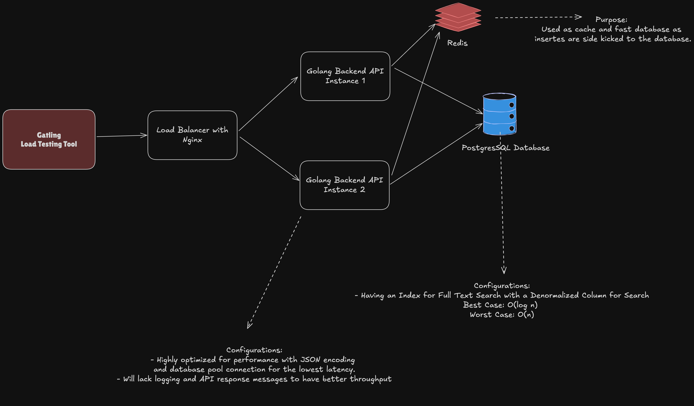

# Rinha de Backend with Go (Edition 2023/Q3)

A blazing-fast REST API built with Go for the [Rinha de Backend Q3 2023](https://github.com/zanfranceschi/rinha-de-backend-2023-q3) challenge - a performance-focused competition where APIs must handle intense loads with minimal resources (just 1.5 CPU cores and 3GB RAM). This project demonstrates clean architecture, efficient database handling, and production-ready practices in Go while achieving exceptional throughput under heavy concurrency.

## 🎯 Challenge Overview

Build a REST API that can handle:
- Creating people with unique nicknames
- Retrieving people by ID
- Searching people by term (across nickname, name, and stack)
- Counting total records
- Handling high concurrency with limited resources (1.5 CPUs and 3GB RAM total)

## 🚀 Technical Stack

- **API**: Framework `Fiber` for high-performance HTTP handling
- **Database**: PostgreSQL with `pgx` and `pgxpool` for efficient connection management
- **Load Balancer**: Nginx for request distribution across API instances
- **Architecture**: Clean architecture with separation of concerns
  - Domain-driven design
  - Repository pattern
  - Dependency injection
  - Middleware support
- **Caching**: Redis and the `ruedis` for Redis Driver

## 🏗️ System Design

## Getting Started

* Install Docker
* Run `docker compose up -d --build` or `make build-and-run`

# References
- https://github.com/zanfranceschi/rinha-de-backend-2023-q3

# License

[LICENSE](./LICENSE)